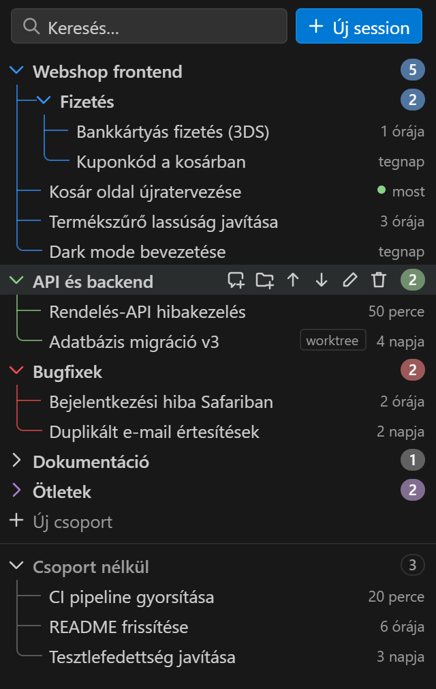
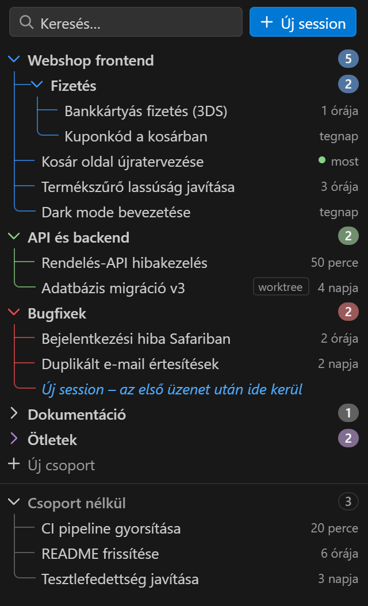
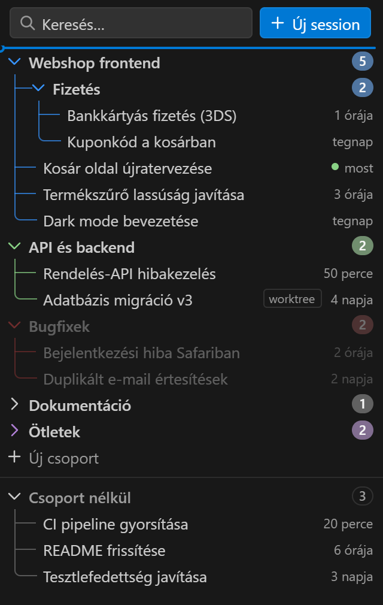
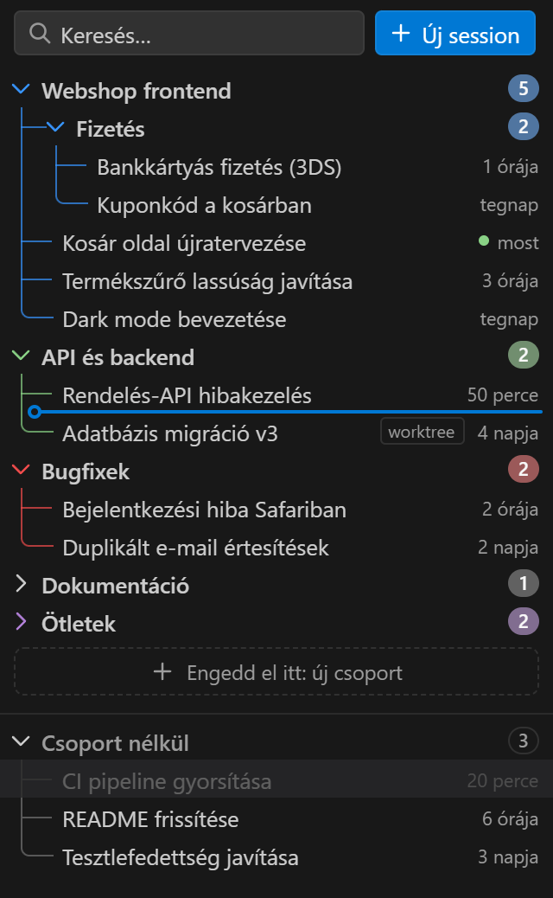

# Claude Code Csoportok

Komolyabb session-csoportosítás a **Claude Code for VS Code** mellé. Saját oldalsávot ad
(tevékenységsáv → *Claude csoportok*), amelyben a munkaterület Claude Code session-jei
csoportokba rendezhetők. Egy kattintással ugyanúgy a Claude Code-ban nyílnak meg, mint a
hivatalos listából.

<p>
  
  
</p>

| Csoport áthúzása egy másik fölé | Session húzása csoportba vagy új csoportba |
| --- | --- |
|  |  |

## Mit tud

- **Átrendezhető csoportok**: húzd a csoportot egy másik fölé vagy alá. Kék vonal mutatja,
  hová kerül. Ugyanez megy a ↑/↓ gombokkal (a sor fölé vitt egérrel), `Alt+↑`/`Alt+↓`-vel
  és a jobbklikkes menüből is („Mozgatás a legtetejére/legaljára”).
- **Alcsoportok (mappák)**: egy csoportban tetszőleges mélységig lehetnek újabb csoportok.
  Előbb az alcsoportok jönnek, utána a session-ök; a fa-vonalak minden szinten folytatódnak,
  a szín öröklődik (ha az alcsoportnak nincs sajátja), a számláló az egész ágat számolja.
- **Behúzott elemek előtaggal**: a csoportok session-jei beljebb kezdődnek, előttük
  faszerkezet-vonalak (`├─` / `└─`) vagy más előtag áll: pont, nyíl, gondolatjel, sorszám
  vagy saját szöveg. A behúzás pixelre állítható.
- **Session-ök húzása**: csoportok között, csoporton belül adott helyre, vissza a
  *Csoport nélkül* részbe, vagy a húzás közben megjelenő *„Engedd el itt: új csoport”*
  mezőre. Több session is kijelölhető és húzható egyszerre (`Ctrl`/`Shift`+kattintás).
- **Színek** a csoportokhoz (a nyíl, a vezetővonal és a számláló színe), **ékezetfüggetlen
  keresés** kiemeléssel, relatív idő („2 órája”), zöld pont a nemrég aktív session-nél,
  `worktree` jelölés.
- **Importálás a hivatalos extensionből**: ha a Claude Code saját csoportjaiban már van
  valami ehhez a munkaterülethez, első indításkor felajánlja az átvételüket. Később
  kézzel is kérheted: `…` menü → *Csoportok importálása a Claude Code-ból…*
- **Több ablak**: a csoportok egy közös fájlban vannak, a nyitott ablakok azonnal
  szinkronban maradnak.

## Használat

| Művelet | Hogyan |
| --- | --- |
| Új session | *＋ Új session* gomb a kereső mellett (vagy `+` a nézet fejlécén) |
| Új session egy csoportba | a csoport során megjelenő ＋ ikon vagy jobbklikk. Terminálos módban azonnal a csoportba kerül, a Claude Code panelen az első üzenet után (addig egy villogó „Új session” sor jelzi, rákattintva visszavonható) |
| Új csoport | `+` ikon a nézet fejlécén, *+ Új csoport* sor, vagy session-ök húzása az új csoport mezőre |
| Új alcsoport | a csoport során megjelenő mappa ikon, vagy jobbklikk → *Új alcsoport* |
| Session megnyitása | kattintás (vagy `Enter`) – a Claude Code saját paneljén nyílik meg |
| Csoport átrendezése | húzás, ↑/↓ gomb, `Alt+↑`/`Alt+↓`, jobbklikk (a testvérei között) |
| Csoport másik csoportba | húzd egy csoport sorának közepére (a felső/alsó szélére húzva elé/mögé kerül); `Alt+→`: bele a fölötte lévő csoportba, `Alt+←`: ki a szülőjéből; jobbklikk → *Áthelyezés csoportba…* |
| Session áthelyezése | húzás, jobbklikk → *Áthelyezés csoportba…*, `Delete` = ki a csoportból |
| Átnevezés | `F2` vagy a ceruza ikon |
| Csoport törlése | kuka ikon vagy `Delete` (az alcsoportjai is törlődnek; a session-ök megmaradnak, csak kikerülnek a csoportokból) |
| Keresés | `Ctrl+F` vagy `/` a listában, `Esc` törli |
| Navigálás | `↑`/`↓`, `←`/`→` (összecsuk/kinyit), `Home`/`End`, `Space` (kijelölés), `Ctrl+A` |

Jobbklikkre a session-ökön további parancsok is vannak: *Folytatás terminálban*
(`claude --resume <id>`), *Session ID másolása*, *Megjelenítés a fájlkezelőben*.

## Beállítások

| Beállítás | Alapérték | Leírás |
| --- | --- | --- |
| `claudeGroups.itemPrefix` | `tree` | Előtag: `tree`, `bullet`, `arrow`, `dash`, `number`, `custom`, `none` |
| `claudeGroups.customPrefix` | `»` | Saját előtag (`custom` módban) |
| `claudeGroups.itemIndent` | `12` | Az elemek extra behúzása pixelben a csoport nevéhez képest |
| `claudeGroups.showIndentGuide` | `true` | Függőleges vezetővonal (a `tree` módban mindig látszik) |
| `claudeGroups.showTimestamps` | `true` | Utolsó aktivitás ideje |
| `claudeGroups.sessionOrder` | `manual` | Sorrend a csoportokon belül: `manual` (húzással), `recent`, `name` |
| `claudeGroups.ungroupedPosition` | `bottom` | A csoport nélküli session-ök helye: `bottom`, `top`, `hidden` |
| `claudeGroups.openOnSingleClick` | `true` | Egy kattintásra nyíljon-e meg a session |
| `claudeGroups.openWith` | `auto` | `panel`: a Claude Code extension panelje, `terminal`: a sima `claude` CLI a VS Code termináljában, `auto`: panel, ha van Claude Code extension (és nincs bekapcsolva a `claudeCode.useTerminal`) |
| `claudeGroups.claudeCommand` | *(üres)* | A `claude` futtatható fájl a terminálos módhoz. Üresen sorban keresi: PATH, a Claude Code extension saját binárisa, a Claude desktop app binárisa |
| `claudeGroups.claudeConfigDir` | *(üres)* | A Claude mappája, ha nem `~/.claude` (egyébként a `CLAUDE_CONFIG_DIR`-t is figyeli) |

## Hogyan működik

- A session-öket ugyanonnan olvassa, ahonnan a Claude Code: `~/.claude/projects/<mappa>/*.jsonl`.
  Ide ír a VS Code extension, a terminálos `claude` CLI és a Claude desktop app is, így
  bármelyikben indított session megjelenik, ha ugyanabban a mappában futott.
  Az első munkaterület-mappa és a hozzá tartozó `.claude/worktrees/*` session-jei jelennek meg.
  A cím ugyanúgy képződik, mint a hivatalos listában (saját cím → AI-cím → utolsó kérés).
  Nagy átiratoknál is csak az első és az utolsó 64 KB-ot olvassa, az eredményt gyorsítótárazza.
- Sok csoporttal és több ezer session-nel is gyors marad: a lista virtualizált (csak a látható
  sorok vannak a DOM-ban), a nézet a session-öket egyszer kapja meg egészben, utána csak a
  változásokat, és ha egy átirat változik, csak azt az egy fájlt olvassa újra. A teljes mappát
  indításkor, frissítéskor és (nyitott nézetnél) 20 másodpercenként nézi át.
- A megnyitás a Claude Code `claude-vscode.editor.open` parancsával történik (panel), vagy
  terminálban a sima CLI-vel: `claude --resume <id>`. Ez közvetlenül a `claude` folyamatot
  indítja a terminálban, shell nélkül (lásd `claudeGroups.openWith`).
- A csoportok munkaterületenként a VS Code globális tárhelyén vannak:
  `%APPDATA%\Code\User\globalStorage\zaza.claude-code-groups\groups.json`.
  A session-átiratokat az extension soha nem módosítja.

## Korlátok

- A hivatalos Claude Code extension zárt kódú, és nem ad API-t a saját csoportjaihoz.
  Ezért ez egy **külön nézet**, saját csoportokkal. Az import csak egyirányú (a hivatalosból
  ide), a hivatalos lista csoportjai nem változnak.
- Csak a gépen lévő (helyi) session-ök látszanak, a felhőbeli/távoli session-ök nem.

## Telepítés és eltávolítás

Töltsd le a `.vsix` fájlt a [Releases](https://github.com/ravencs2hs-del/claude-code-vscode-enhancer/releases)
oldalról, majd:

```bash
code --install-extension claude-code-groups-1.3.0.vsix
```

```bash
code --uninstall-extension zaza.claude-code-groups
```

## Fejlesztés

Nem kell hozzá Node vagy npm, minden a VS Code beépített Node-jával fut
(`ELECTRON_RUN_AS_NODE=1`):

- Unit tesztek: `test/unit.test.js`
- Böngészős előnézet mock hosttal: `test/serve.cmd`, majd `http://localhost:8765/`
  (`?prefix=bullet&indent=24&latency=60` stb.)
  - A konzolban `await checks()` végigpróbálja a nézet működését (billentyűzet, kijelölés,
    keresés, átnevezés, húzás, görgetés sok sorral); friss, paraméter nélküli oldalon futtasd.
  - Terheléses teszt: `?stress=80x40+400` (80 csoport × 40 session + 400 csoport nélküli),
    majd `await bench()` kiírja, hány ms egy-egy művelet.
- Integrációs tesztek külön VS Code példányban: `test/run-integration.ps1`
- VSIX készítése: `scripts/pack.js`

## Licenc

[MIT](LICENSE)
