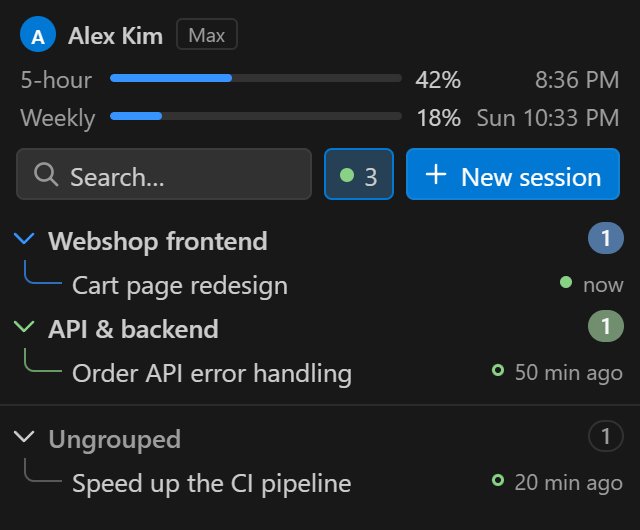

# Claude Enhancer

A better home for your **Claude Code** sessions in VS Code. It adds its own side bar view
(Activity Bar → *Claude Enhancer*) where the Claude Code sessions of your workspace can be
organized into groups and folders, filtered down to the ones that are running, with your
account and plan usage limits on top. A click opens a session in Claude Code, just like the
official list does.

<p>
  
  
  
</p>

| Dragging a group above another one | Dragging a session into a group or a new group |
| --- | --- |
|  |  |

## Why

I built this with **Claude Opus 5.5**. The idea came from frustration: organizing sessions in
the official Claude Code extension is terrible, and it's a pain in the Claude desktop app too.

## Features

- **Usage limits and account on top**: your 5-hour and weekly limits with a bar, the percentage
  used and when they reset, plus the signed-in account and plan. Figures turn orange above 70%
  and red above 90%.
- **Active sessions**: the `● 3` button next to the search box shows how many sessions a Claude
  Code process has open; click it to see only those, still inside their groups. A pulsing dot
  means Claude is working on it, a ring means it is open and waiting for you.
- **Groups you can rearrange**: drag a group above or below another one; a blue line shows
  where it goes. The ↑/↓ buttons (on hover), `Alt+↑`/`Alt+↓` and the context menu
  (*Move to Top/Bottom*) do the same.
- **Subgroups (folders)**: groups can hold further groups, to any depth. Subgroups come first,
  then the sessions; the tree lines continue on every level, a subgroup without a color of its
  own takes its parent's, and the counter counts the whole branch.
- **Indented sessions with a prefix**: sessions start further in than their group, after tree
  lines (`├─` / `└─`) or another prefix: bullet, arrow, dash, number or your own text. The
  indentation is adjustable in pixels.
- **Drag sessions** between groups, to a given place inside a group, back to *Ungrouped*, or
  onto the *"Drop here: new group"* zone that appears while dragging. Several sessions can be
  selected and dragged at once (`Ctrl`/`Shift`+click).
- **Colors** for groups (arrow, guide line and counter), **accent-insensitive search** with
  highlighting, relative times ("2 h ago"), a green dot on recently active sessions and a
  `worktree` tag.
- **Fast with big workspaces**: the list is virtualized and only changed sessions are sent to
  it, so thousands of sessions in hundreds of groups stay smooth.
- **Import from the official extension**: if the Claude Code extension already has groups for
  the workspace, the first start offers to take them over. You can also ask for it later:
  `…` menu → *Import Groups from Claude Code…*
- **Several windows**: groups live in one shared file; open windows stay in sync.
- **English and Hungarian**: follows the display language of VS Code, or pick one with
  `claudeGroups.language`.

## Usage

| Action | How |
| --- | --- |
| New session | *＋ New session* button next to the search box (or `+` in the view's title bar) |
| New session in a group | the ＋ icon on the group's row, or right-click. In terminal mode it joins the group right away; in the Claude Code panel after its first message (until then a pulsing "New session" row shows it, click it to cancel) |
| New group | `+` icon in the view's title bar, the *+ New group* row, or drag sessions onto the new group zone |
| New subgroup | the folder icon on the group's row, or right-click → *New Subgroup* |
| Open a session | click (or `Enter`) – it opens in the Claude Code panel |
| Reorder groups | drag, ↑/↓ buttons, `Alt+↑`/`Alt+↓`, right-click (among its siblings) |
| Move a group into another one | drag it onto the middle of a group's row (the top/bottom edge puts it before/after); `Alt+→`: into the group above it, `Alt+←`: out of its parent; right-click → *Move to Group…* |
| Move sessions | drag, right-click → *Move to Group…*, `Delete` = out of the group |
| Rename | `F2` or the pencil icon |
| Delete a group | trash icon or `Delete` (its subgroups go too; the sessions stay, they just leave the groups) |
| Search | `Ctrl+F` or `/` in the list, `Esc` clears it |
| Only the active sessions | the `●` button next to the search box (click again to show all) |
| Navigate | `↑`/`↓`, `←`/`→` (collapse/expand), `Home`/`End`, `Space` (select), `Ctrl+A` |

Right-clicking a session offers more: *Resume in Terminal* (`claude --resume <id>`),
*Copy Session ID*, *Reveal in File Explorer*.

## Settings

| Setting | Default | Description |
| --- | --- | --- |
| `claudeGroups.language` | `auto` | Language of the view and its messages: `auto` (same as VS Code), `en`, `hu`. Command names and settings always follow VS Code |
| `claudeGroups.showAccount` | `true` | Show the signed-in Claude account at the top |
| `claudeGroups.showLimits` | `true` | Show the plan usage limits (5-hour and weekly) at the top |
| `claudeGroups.itemPrefix` | `tree` | Prefix: `tree`, `bullet`, `arrow`, `dash`, `number`, `custom`, `none` |
| `claudeGroups.customPrefix` | `»` | Your own prefix (in `custom` mode) |
| `claudeGroups.itemIndent` | `12` | Extra indentation of the items in pixels, relative to the group's name |
| `claudeGroups.showIndentGuide` | `true` | Vertical guide line (always shown in `tree` mode) |
| `claudeGroups.showTimestamps` | `true` | Time of the last activity |
| `claudeGroups.sessionOrder` | `manual` | Order inside groups: `manual` (by dragging), `recent`, `name` |
| `claudeGroups.ungroupedPosition` | `bottom` | Where the sessions without a group go: `bottom`, `top`, `hidden` |
| `claudeGroups.openOnSingleClick` | `true` | Open a session with a single click |
| `claudeGroups.openWith` | `auto` | `panel`: the Claude Code extension's panel, `terminal`: the plain `claude` CLI in the VS Code terminal, `auto`: the panel if the Claude Code extension is installed (and `claudeCode.useTerminal` is off) |
| `claudeGroups.claudeCommand` | *(empty)* | The `claude` executable for terminal mode. When empty it looks in this order: PATH, the binary of the Claude Code extension, the binary of the Claude desktop app |
| `claudeGroups.claudeConfigDir` | *(empty)* | Claude's folder if it is not `~/.claude` (`CLAUDE_CONFIG_DIR` is honored too) |

## How it works

- Sessions are read from where Claude Code keeps them: `~/.claude/projects/<folder>/*.jsonl`.
  The VS Code extension, the `claude` CLI and the Claude desktop app all write there, so a
  session started in any of them shows up if it ran in the same folder. The sessions of the
  first workspace folder and its `.claude/worktrees/*` are listed. Titles are made the same way
  as in the official list (custom title → AI title → last prompt). Even for big transcripts
  only the first and last 64 KB are read, and the result is cached.
- It stays fast with many groups and thousands of sessions: the list is virtualized (only the
  visible rows are in the DOM), the view gets the sessions once and then only the changes,
  and when a transcript changes only that one file is read again. The whole folder is scanned
  on start, on refresh and every 20 seconds while the view is open.
- The account and the usage limits come from Claude Code's own state file (`~/.claude.json`):
  the signed-in account and the usage figures Claude Code caches while it runs, so they are
  as fresh as Claude Code's last check (the tooltip says when that was). The extension makes
  no network requests and never reads your credentials.
- Active sessions: every running Claude Code process (CLI, VS Code extension, desktop app)
  keeps a small file in `~/.claude/sessions/` with its session and whether it is busy; files
  of processes that are gone are ignored.
- Sessions open with the `claude-vscode.editor.open` command of Claude Code (panel), or in a
  terminal with the plain CLI: `claude --resume <id>`, which starts the `claude` process in the
  terminal directly, without a shell (see `claudeGroups.openWith`).
- Groups are stored per workspace in VS Code's global storage:
  `%APPDATA%\Code\User\globalStorage\zaza.claude-code-groups\groups.json`.
  The extension never changes session transcripts.

## Limitations

- The official Claude Code extension is closed source and has no API for its groups, so this
  is a **separate view** with its own groups. The import only goes one way (from the official
  list to here); the groups of the official list do not change.
- Only local sessions are listed, not cloud/remote ones.

## Install and uninstall

Download the `.vsix` from the [Releases](https://github.com/ravencs2hs-del/claude-code-vscode-enhancer/releases)
page, then:

```bash
code --install-extension claude-code-groups-1.5.0.vsix
```

```bash
code --uninstall-extension zaza.claude-code-groups
```

## Development

No Node or npm needed; everything runs on the Node built into VS Code
(`ELECTRON_RUN_AS_NODE=1`):

- Unit tests: `test/unit.test.js` (they also check that every text has a Hungarian
  translation in `l10n/bundle.l10n.hu.json` and `package.nls.hu.json`)
- Browser preview with a mock host: `test/serve.cmd`, then `http://localhost:8765/`
  (`?prefix=bullet&indent=24&latency=60`, `?lang=hu`, `?demo=1`, …)
  - `await checks()` in the console runs through the view (keyboard, selection, search,
    renaming, drag & drop, subgroups, scrolling with many rows); run it on a fresh page
    without parameters.
  - Load test: `?stress=80x40+400` (80 groups × 40 sessions + 400 ungrouped), then
    `await bench()` prints how many ms each action takes.
  - `?demo=1`, then `await captureAll()` recreates the screenshots in `docs/`.
- Integration tests in a separate VS Code instance: `test/run-integration.ps1`
- Building the VSIX: `scripts/pack.js`

## License

[MIT](LICENSE)
